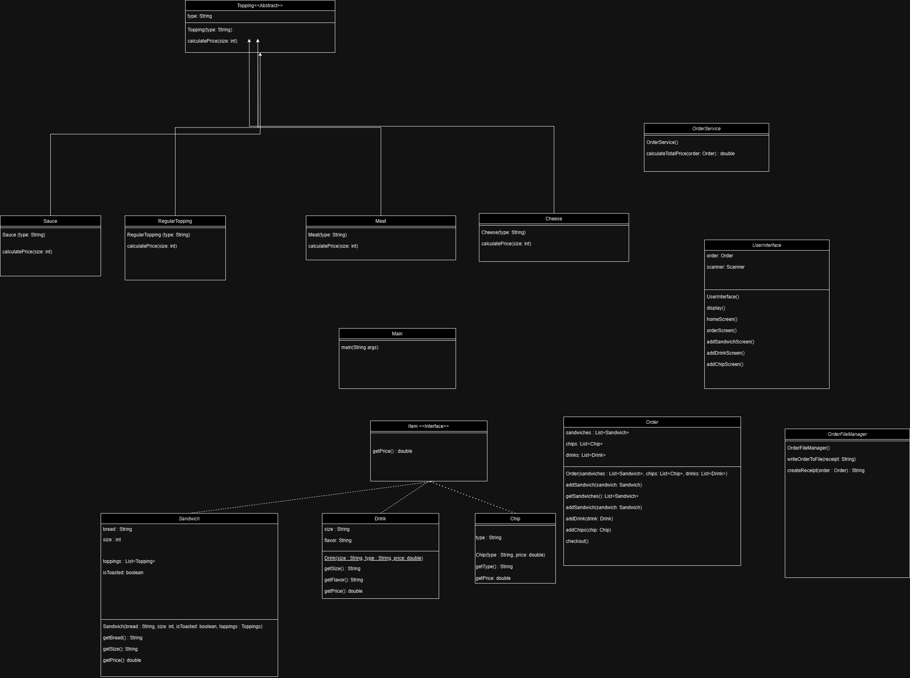

# Deli-cious

## Description of the Project

This project is an application for a custom sandwich shop. The User is prompted to enter what items they would like, and some customizing prompts are provided. Later, the customized products are visualized for the user to checkout. The receipt of the order is saved in a file for safekeeping.

## User Stories

- As a customer, I should be able to order sandwiches in 3 different sizes, so I have the option to order depending on my needs
- As a customer, I should be able to have different bread options for the sandwich, so I can build my sandwich depending on my taste
- As a customer, I should be able to pick the toppings I want in the sandwich, so the toppings I desired are noted for the sandwich
- As a customer, I should be able to pick the toppings from different topping category, so the order I picked is more organized and easier to understand
- As a customer, I should be able to have an option to toast the sandwich, so if I want to have a toasted sandwich that option is visible
- As a customer, I should be able to add multiple sandwiches to the order, so I do not need to spend my time creating multiple orders for different items
- As a customer, I should be able to add drinks to my order, so I do not waste my time with multiple orders
- As a customer, I should be able to add chips to my order, so I can have one order for all of the items I want
- As a customer, I should be able to see the order details at the end of my order, so I can review what I ordered
- As a customer, I should be able to have the total price displayed to me, so I can see how much I owe
- As a customer, I should be able to have the receipt saved to a file, so my order is saved for my keeping
- As a customer, I should be able to pick the size and flavor of the drink, so I can pick a drink that I want
- As a customer, I should be able to pick a flavor of the chips, so I can pick a chip that I want

## Setup

Instructions on how to set up and run the project using IntelliJ IDEA.

### Prerequisites

- IntelliJ IDEA: Ensure you have IntelliJ IDEA installed, which you can download from [here](https://www.jetbrains.com/idea/download/).
- Java SDK: Make sure Java SDK is installed and configured in IntelliJ.

### Running the Application in IntelliJ

Follow these steps to get your application running within IntelliJ IDEA:

1. Open IntelliJ IDEA.
2. Select "Open" and navigate to the directory where you cloned or downloaded the project.
3. After the project opens, wait for IntelliJ to index the files and set up the project.
4. Find the main class with the `public static void main(String[] args)` method.
5. Right-click on the file and select 'Run 'YourMainClassName.main()'' to start the application.

## Technologies Used

- Java 17 
- - java.util.List
- - java.util.ArrayList
- - java.io.BufferedWriter
- - java.io.FileWriter
- - java.time.LocalDateTime
- - java.time.format.DateTimeFormatter
- - java.util.Scanner

## Demo

## Future Work

Outline potential future enhancements or functionalities you might consider adding:

- Additional features to be developed:
- - More product and customizing options
- - Different options for the customers and the employees
- Improvement of current functionalities:
- - More input validation
- - Better organization of the output

## Resources

- No resources were used
## Team Members

- **Emre Akarsu** - Only team member handling all aspects of the project

## Thanks

- Thank you to [Raymond Maroun ] for continuous support and guidance.
